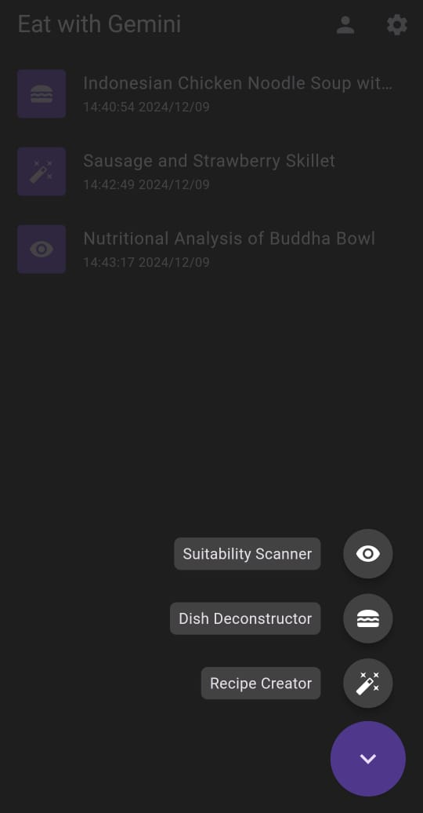
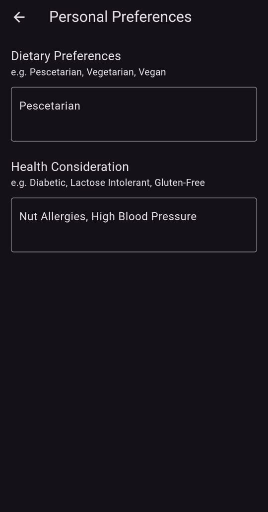

# Eat with Gemini

<p align="center">
    
</p>

**Eat with Gemini** is a Flutter app that leverages the power of the [**Google Gemini LLM**](https://ai.google.dev/) to redefine how users interact with food and nutrition. By combining advanced AI with user-friendly features, this app provides a seamless experience for users to analyze, understand, and optimize their dietary choices.

## Features

### 📸 Scan & Analyze

- **Recipe Creator**  
  Upload an image of ingredients, and the app generates a recipe tailored to the items identified.
- **Dish Deconstructor**  
  Analyze dishes, foods, drinks, or other consumables from an image. The AI will create a recipe on how to make those items.
- **Suitability Analyzer**  
  Understand if a particular dish is suitable for you. The app considers nutritional value, health benefits, and dietary restrictions.

### 🌟 Personalized User Preferences

- **Dietary Preferences**  
  Users can specify their dietary preferences (e.g., vegetarian, keto, gluten-free) for customized recipe recommendations.
- **Health Considerations**  
  Take health factors into account, such as allergies or medical conditions, to ensure the AI provides the most relevant advice.

## Screenshot

<p align="center">
    
    
    
    
    
</p>

## Getting Started

### Prerequisites

- [Flutter SDK](https://flutter.dev/) installed on your machine.
- Get the Google Gemini API Key [ai.google.dev](https://ai.google.dev/).
- Compatible devices/emulators.

### Installation

1. Clone this repository:
   ```bash
   git clone https://github.com/yourusername/eat-with-gemini.git
   ```
2. Navigate to the project directory:
   ```bash
   cd eat-with-gemini
   ```
3. Install dependencies:
   ```bash
   flutter pub get
   ```
4. Run the app:
   ```bash
   flutter run
   ```

## Package Used

- flutter_speed_dial
- url_launcher
- shared_preferences
- flutter_markdown
- sqflite
- path
- intl
- image_picker
- path_provider
- http

## License

This project is licensed under the [MIT License](LICENSE).